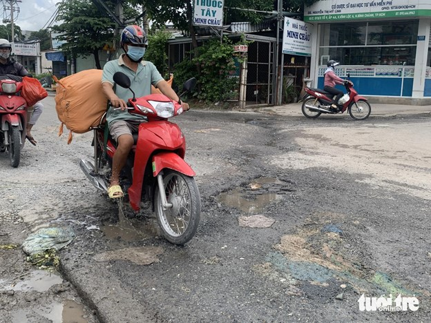

# Pothole_Detector
Pothole detector based on yolov5 architecture. 

## Table of Contents
- [About the Project](#about-the-project)
- [Hardware Used](#hardware-used)
- [Getting Started](#getting-started)
  - [Prerequisites](#prerequisites)
  - [Installation](#installation)
- [Usage](#usage)
- [Dataset](#dataset)
- [Contact](#contact)

## About the project
Since I followed the course [Deep Learning Specialization by Andrew Ng](https://www.coursera.org/specializations/deep-learning?utm_medium=sem&utm_source=gg&utm_campaign=b2c_emea_deep-learning_deeplearning-ai_ftcof_specializations_arte_feb_24_dr_geo-multi_pmax_gads_lg-all&campaignid=21028581571&adgroupid=&device=c&keyword=&matchtype=&network=x&devicemodel=&adposition=&creativeid=&hide_mobile_promo&gad_source=1&gclid=Cj0KCQjwm5e5BhCWARIsANwm06hhA8wU2kgWbyL88m20hSBcq-o6h4FvIAxpVgKr8UjwtD9oQDfUDPIaAkkVEALw_wcB) on Coursera I got very interested in object detection and computer vision. 
Therefore, I wanted to make a project using computer vision. 
Since I will be going on a trip to Vietnam with a motorcycle, and considering the danger of driving in a pothole with a motorcycle, I wanted to make a pothole detector, using hardware that I could take on my trip to Vietnam. The idea was to use a [raspberry pi](https://www.raspberrypi.com/) to perform the object detection, and make a sound or alert me in some way while driving the roads of Vietnam. 

## Hardware Used
For the project, I used the most recent Raspberry Pi at the time (v5) with 8GB of RAM. For Vietnam, I also included an active cooler fan, a case, and a tripod to mount the camera somewhere on the motorcycle. 
- [Raspberry Pi 5 8GB RAM](https://www.raspberrystore.nl/PrestaShop/nl/raspberry-pi-5/508-raspberry-pi-5-8gb-5056561803326.html)
- [Camera Module 3](https://www.amazon.de/dp/B0BRY6MVXL?ref=ppx_yo2ov_dt_b_fed_asin_title)
- [Active Cooler Fan](https://www.amazon.de/dp/B0CLXZBR5P?ref=ppx_yo2ov_dt_b_fed_asin_title) 
- [Camera cable to Raspberry Pi 5](https://www.amazon.de/-/en/dp/B079H33VCM?ref=ppx_yo2ov_dt_b_fed_asin_title&th=1) 
- [Tripod for Camera](https://www.amazon.de/-/en/dp/B0D6NGGPQM?ref=ppx_yo2ov_dt_b_fed_asin_title) 
- [Raspberry Pi Case](https://www.amazon.de/-/en/dp/B0CRB3DT5M?ref=ppx_yo2ov_dt_b_fed_asin_title)

## Getting Started
### Prerequisites
### Installation

## Dataset
The dataset used for training the pothole detector can be found on [Kaggle](https://www.kaggle.com/datasets). 
Download the dataset and place it in your working directory. 
I chose the following distribution for the test, training and validation. The high training percentage (90%) is because this dataset was used to train an initial model before I added real data from my Raspberry Pi camera into the dataset. 

## Contact 
Contact me on Linkedin using [My Linkedin](https://www.linkedin.com/in/vincent-maes/)
